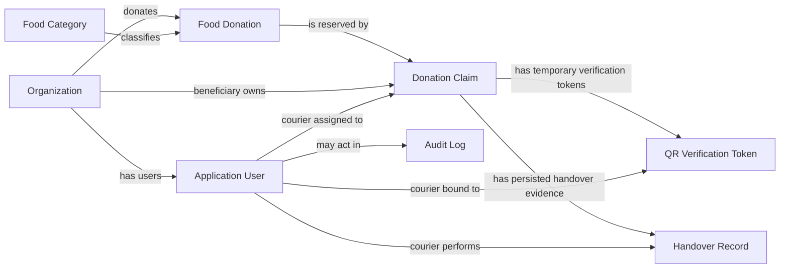
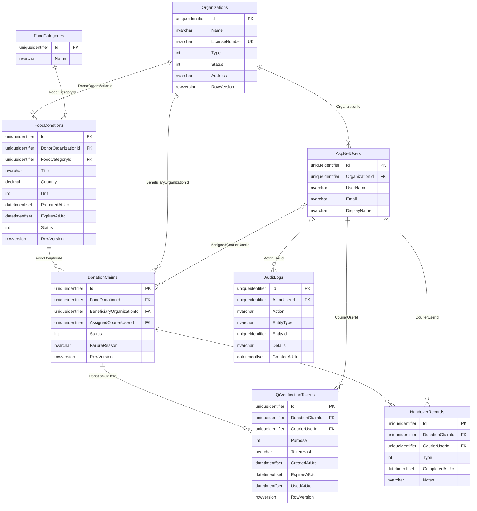

# FoodLoop ERD and physical database diagram

These diagrams describe the implemented SQL Server model used by the application. They are documentation only; Stage 3 adds no schema or migration.

## Conceptual ERD

Core lifecycle state lives on `FoodDonation` and `DonationClaim`. `HandoverRecord` is evidence, not a parallel task state. Raw QR values are never stored; `QrVerificationToken` stores the hash and binding metadata.

## Physical SQL Server diagram

ASP.NET Core Identity also owns its standard supporting tables such as roles, user-role joins, claims, logins and tokens. They are omitted from the diagram above so the FoodLoop business relationships remain readable.

## Important constraints

- Organization LicenseNumber is unique.
- Food donation quantity and prepared/expiry ordering are protected by database constraints.
- Donation/Claim/QR concurrency-sensitive rows use RowVersion.
- Only one active claim slot is allowed for a donation by the existing filtered unique index.
- Handover evidence is unique per claim/type.
- QR purpose and lifecycle/status values are constrained to the committed enum ranges.
